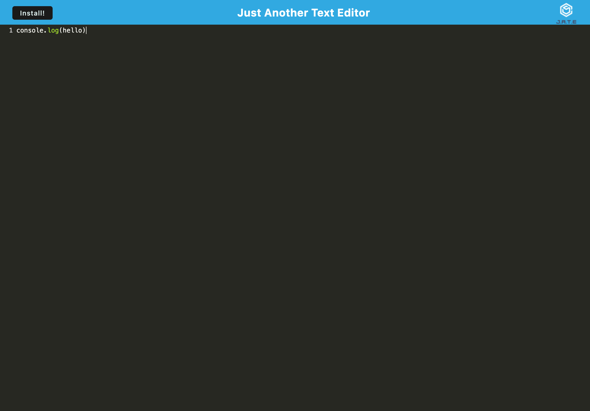

# Progressive Web Application (PWA): Text Editor

## Description

This project involves building a text editor that runs in the browser as a Progressive Web Application (PWA). The application is a single-page app that meets PWA criteria, ensuring it functions offline and provides a reliable user experience. The text editor supports various data persistence techniques, ensuring data redundancy in case one option is not supported by the browser.

## User Story

As a user, I want to be able to:
- **Create, Edit, and Save Text Files**: Easily create and edit text files directly in the browser.
- **Access My Files Offline**: The application should work seamlessly even when offline, allowing me to access and modify my text files.
- **Automatically Sync Data**: Ensure that my data is synchronized and saved across different sessions using IndexedDB and other data persistence methods.
- **Reliable and Fast Performance**: Enjoy a smooth and responsive experience when using the text editor.

## Features

- **Single-Page Application**: The editor runs as a single-page application (SPA) for a seamless user experience.
- **PWA Compliance**: Meets all criteria for a Progressive Web Application, including offline functionality.
- **Data Persistence**: Utilizes IndexedDB with the `idb` package for robust data storage and retrieval. Implements redundancy techniques to ensure data reliability.
- **Offline Functionality**: The application functions effectively offline, allowing users to continue working without an internet connection.
- **Deployment**: Deployed on Render for easy access and management.

[Link to website on Render](https://texteditor-y11g.onrender.com)

